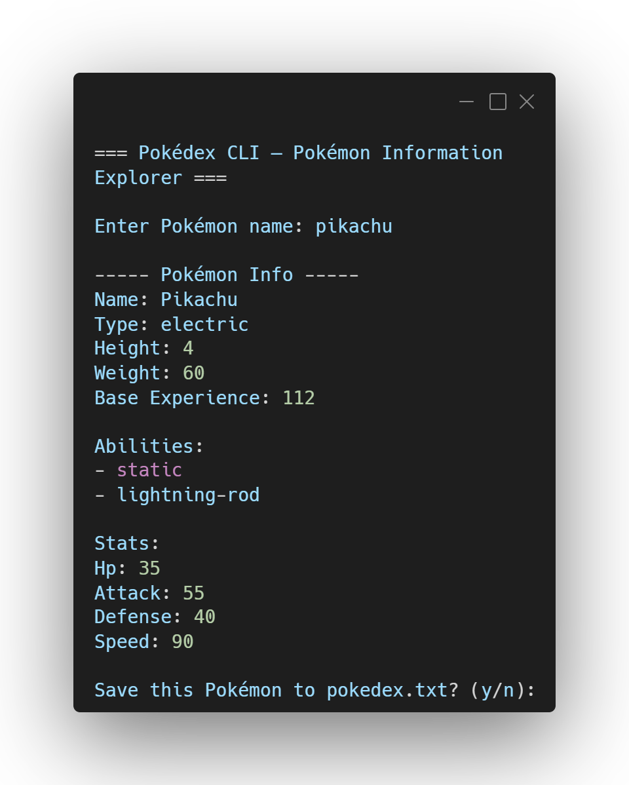
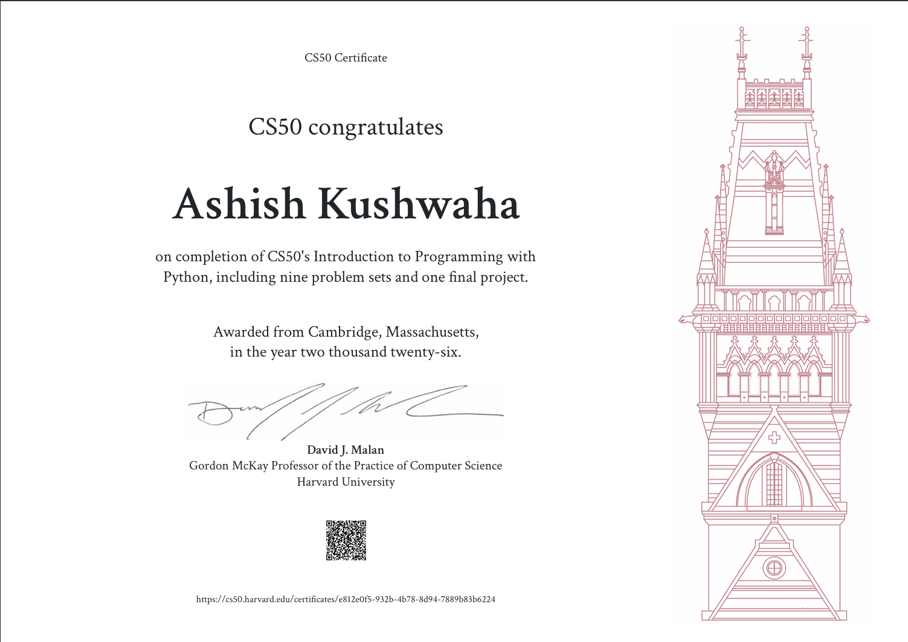

# 🐉 Pokédex CLI — My CS50P Final Project


----------

# 📚 About This Project

This repository contains my final project for **Harvard's CS50: Introduction to Programming with Python** (CS50P). 

I wanted to build something fun but practical that tested what I learned, so I created a command-line Pokédex. It lets you search for any Pokémon by name and instantly pulls up their stats, types, abilities, and physical traits using the live [PokeAPI](https://pokeapi.co/).

> 🔗 **My Learning Journey:** If you want to see all the notes, practice code, and mini-projects I built during the 45 days leading up to this final project, check out my complete [Python Learning Journey Repository](https://github.com/ashishbtech/python-learning-journey)!

----------

# 📸 Terminal Preview

Here is a quick look at the Pokédex CLI in action:

<p align="center">
  
</p>


----------

# 🎓 CS50P Certificate

This project was the final hurdle after 45 days of consistent learning and coding. Here is my official certificate of completion:

<p align="center">
  
</p>


----------

# 🧠 Core Concepts I Applied

  
  
  
  
  

----------

# 🚀 What It Does

- **Live API Fetching:** Uses Python's `requests` library to grab real-time JSON data straight from PokeAPI.
- **Clean Terminal Output:** Nobody likes reading raw JSON. The script parses the data and formats it into a clean, readable terminal layout.
- **Error Handling:** It won't crash if you spell a Pokémon's name wrong or if your internet drops. I built in `try/except` blocks to handle timeouts and bad requests smoothly.
- **Local Saving:** If you look up a Pokémon you like, the app asks if you want to save it. If you say yes, it appends the Pokémon and its typing to a local `pokedex.txt` file so you can build a custom roster.

----------

# 💻 How to Run It

Want to try it out? You just need Python and the `requests` library.

1. **Clone the repo:**
   ```bash
   git clone [https://github.com/ashishbtech/.git](https://github.com/ashishbtech/cs50p-pokedex.git)
   cd cs50p-pokedex
   ```

2. **Install the requests module:**
   ```bash
   pip install requests
   ```

3. **Start the Pokédex:**
   ```bash
   python project.py
   ```

----------

# 🎯 Personal Goals for this Project

✔ Actually finish CS50P!  
✔ Build a working CLI tool from scratch.  
✔ Learn how to talk to external REST APIs and parse the JSON responses.  
✔ Write clean, modular functions rather than one giant block of code.  
✔ Practice defensive programming by handling user typos and network errors.

----------

# ⭐ Final Thoughts

Building this was the perfect way to wrap up my Python learning journey. It forced me to combine basic loops and control flow with external libraries and file handling. 

On to the next project! 🚀